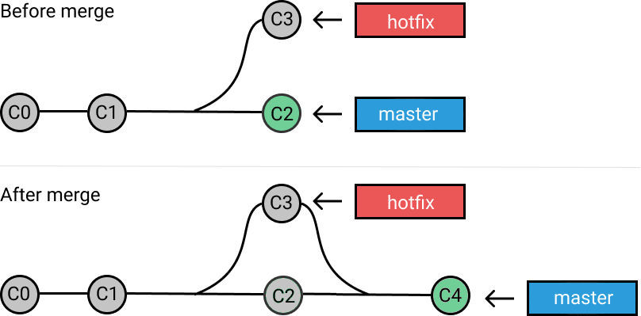
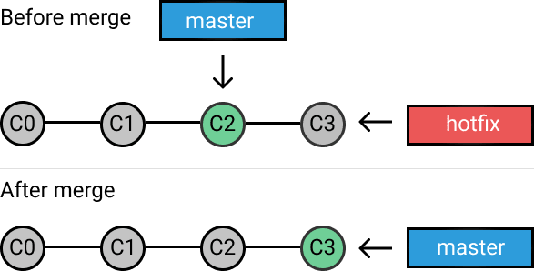
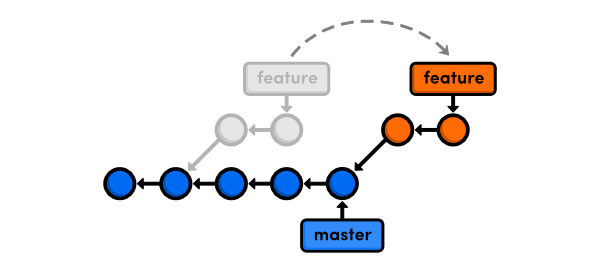

# Git Rebase Lab

Maitriser git merge, git rebase et la gestion des conflits

## Notes

Les labs sont sous forme d'issues, merci de ne pas cocher les cases, ni non plus fermer les issues

## Merge

- Permet de fusionner les commits d'une branche sur une autre branche. Sur un projet où la branche `master` correspond à la prochaine version, on fait toujours un merge d'une branche de `feature` sur la branche `master`
- Cette technique permet de regrouper les modifications et faire avancer la branche `master`
- Dans la plupart des cas, le merge crée un commit supplémentaire (three-way merge) :

- Dans le cas où, l'historique est aligné entre les deux branches, le merge produit un fast-forward, sans création de commit supplémentaire :

## Rebase

Le rebase permet de garder un historique linéaire entre les branches. Généralement sur un projet, cette technique est utilisée pour garder les branches de travail alignées avec la branche de base (`master` ou `feature`) afin de :

1. Récupérer les dernières fonctionnalités
1. Eviter les conflits
1. S'assurer que chaque branche de travail porte ses propres modifications

Idem que le merge, si l'historique est déjà aligné entre les deux branches, le rebase produit un fast-forward

## Conclusion

- Le merge est utilisé pour fusionner un ou plusieurs commits sur une branche de base
- Le rebase est utilisé pour rester à jour et aligner l'historique par rapport à la branche de base
